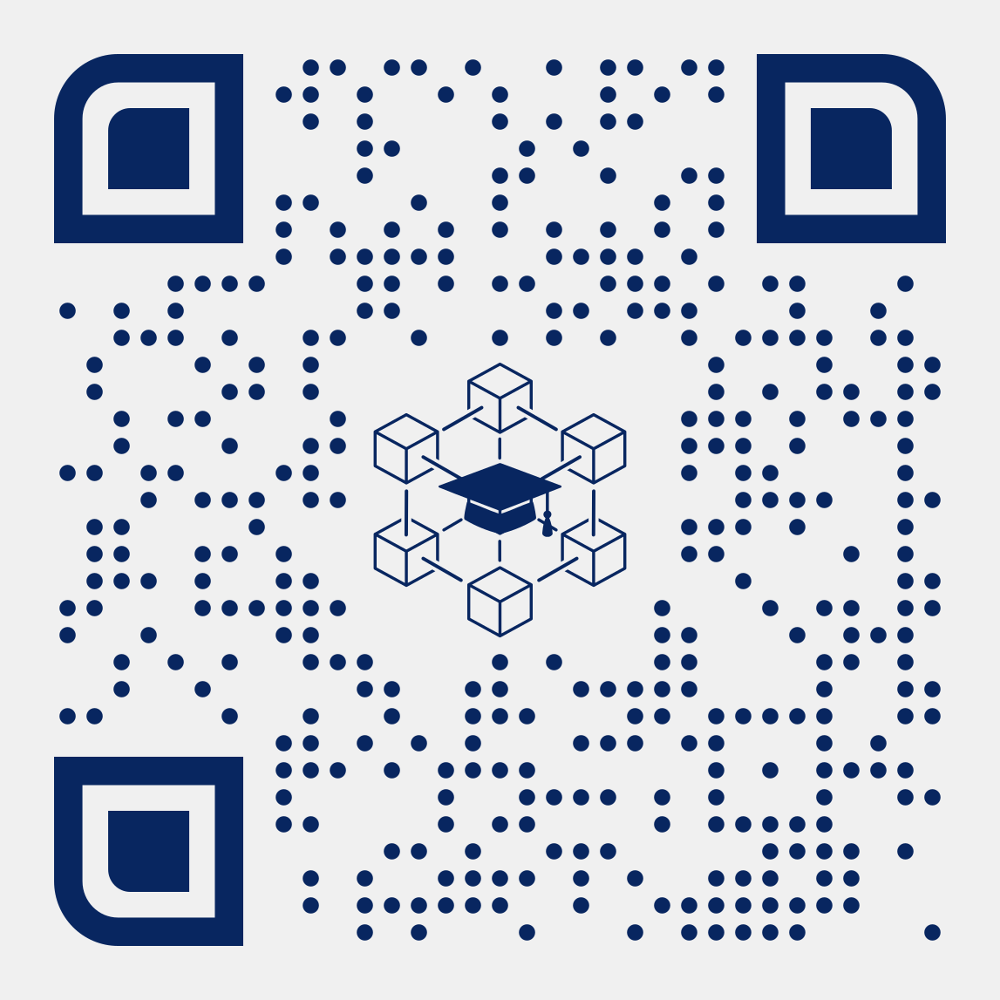
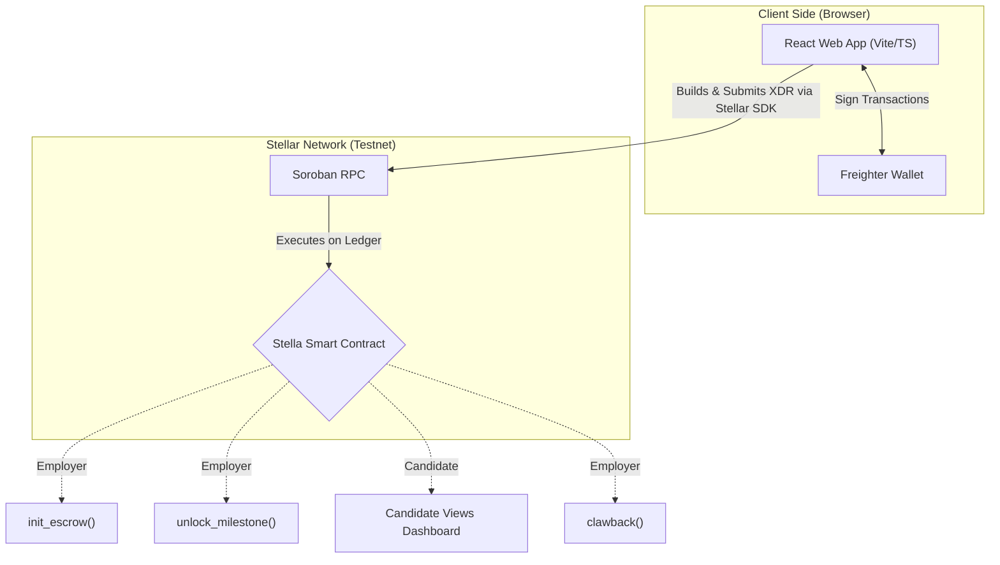

# Stella ⭐

<div align="center">
  
  <h1>Stella</h1>
  
  <p><strong>A milestone-based escrow dApp built on Soroban to end the Day Zero poverty trap for fresh graduates.</strong></p>

  <p>
    <a href="https://stella-escrow.vercel.app/"></a>
    &nbsp;&nbsp;&nbsp;&nbsp;&nbsp;&nbsp;
    <a href="https://github.com/delatorrecj/stellar"></a>
  </p>

  <p>
    
  </p>
</div>

## What is Stella?

Stella bridges the trust gap between employers and job candidates during onboarding. Employers lock onboarding funds into a Soroban smart contract. Candidates claim those funds as they complete milestones. If something goes wrong, employers can recover their remaining balance. No middlemen, no delays, no hidden fees.

**Built for the Stellar Smart Contract Bootcamp 2026.**

---

## Architecture

### System Design



> **Note on Programmatic Trust (V1 vs V2):** For the purpose of this bootcamp MVP (V1), Stella acts as a generalized unlockable vault where the employer specifies the raw XLM amount to release dynamically. V2 will feature zero-knowledge on-chain milestone hashing for pre-determined arrays of deliverables.

### Directory Structure

```
stella/
├── contract/          Soroban smart contract (Rust)
│   └── src/
│       ├── lib.rs     Core escrow logic (Single-Job Overwrite Fixed)
│       ├── test.rs    Unit tests (3+ passing)
│       ├── types.rs   Data structures
│       └── events.rs  On-chain event definitions
│
├── frontend/          React + Vite dApp (PWA Ready)
│   └── src/
│       ├── pages/     Dashboard, Employer, Candidate
│       ├── components/ Layout, WalletButton, EscrowCard, Toast
│       ├── hooks/     useStellar (wallet), useEscrow (contract)
│       └── lib/       Soroban client, network config
│
├── docs/              Documentation & Specifications
│   ├── branding.md
│   ├── build.md
│   ├── context.md
│   └── product_requirements.md
│
└── README.md          ← You are here
```

## Smart Contract

| Function           | Description                           |
| ------------------ | ------------------------------------- |
| `init_escrow`      | Lock onboarding funds (with duration) |
| `unlock_milestone` | Employer releases partial amount      |
| `clawback`         | Employer recovers remaining funds     |
| `get_escrow`       | View escrow details for a candidate   |

**Contract ID:** `CCYWJ3RXON6AUJT32ME522B3W5D5PMPG4CUEBJEI6UA3AKRF4SOXP5MU`
**Network:** Stellar Testnet

## Getting Started

### Prerequisites

- Node.js 18+
- Rust + `wasm32-unknown-unknown` target
- Stellar CLI v26+
- Freighter browser extension

### Run the Frontend

```bash
cd frontend
npm install
npm run dev
```

### Build & Test the Contract

```bash
cd contract
cargo test
stellar contract build
```

## Testing & Simulation

To test the complete end-to-end flow locally, you can simulate both the Employer and Candidate using a single Freighter extension:

1. **Create Two Accounts**: Open Freighter, click the gear icon (Settings) -> Accounts -> **"Create new wallet"**. This generates a second account from your seed phrase. Rename them to **"Employer"** and **"Candidate"**.
2. **Fund via Friendbot**: Ensure your network is set to **Testnet**. Select your "Employer" account and click "Fund with Friendbot" (or "Get test network lumens") to receive 10,000 test XLM. Do the same for the "Candidate" account.
3. **Simulate the Employer**: With the "Employer" account active in Freighter, connect to the dApp and click "I'm hiring someone". Initiate an escrow by pasting the public key of your "Candidate" account.
4. **Simulate the Candidate**: Once the escrow is funded and locked, switch your Freighter active account to "Candidate". Return to the dApp landing page, switch your role to Candidate, and you will securely see the funds waiting for you to claim!

## Tech Stack

| Layer    | Technology                               |
| -------- | ---------------------------------------- |
| Contract | Rust, Soroban SDK, soroban-sdk v22       |
| Frontend | React 19, Vite 6, Tailwind CSS v4        |
| PWA      | vite-plugin-pwa, Service Workers         |
| Wallet   | Freighter API v6                         |
| Network  | Stellar Testnet, Soroban RPC             |
| Design   | "Warm Fintech Trust" (Plus Jakarta Sans) |

## Author

- Carlos Jerico Dela Torre
- BS Computer Engineering
- Polytechnic University of the Philippines

## License

MIT — Stellar Bootcamp Philippines 2026 (April 18 • Whitecloak Ortigas)
