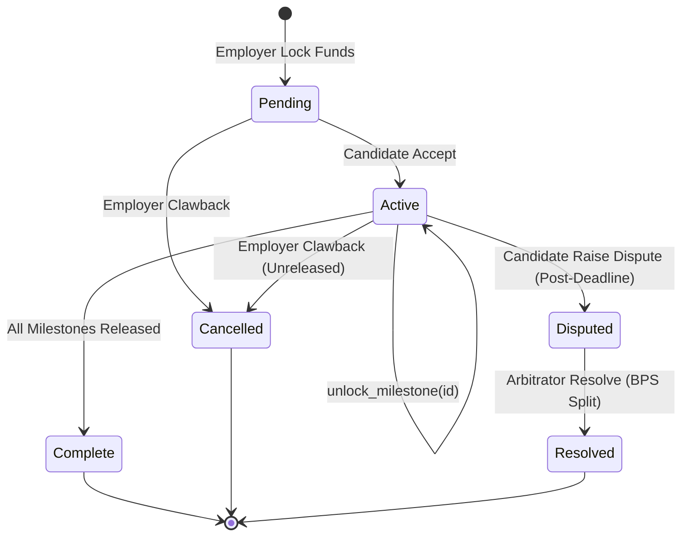
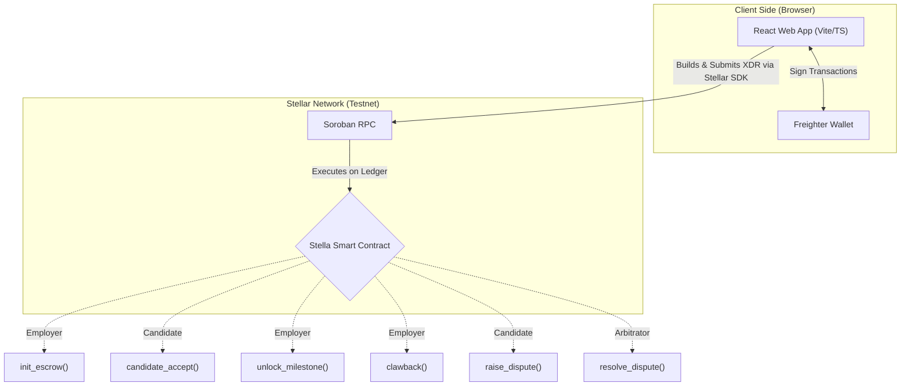
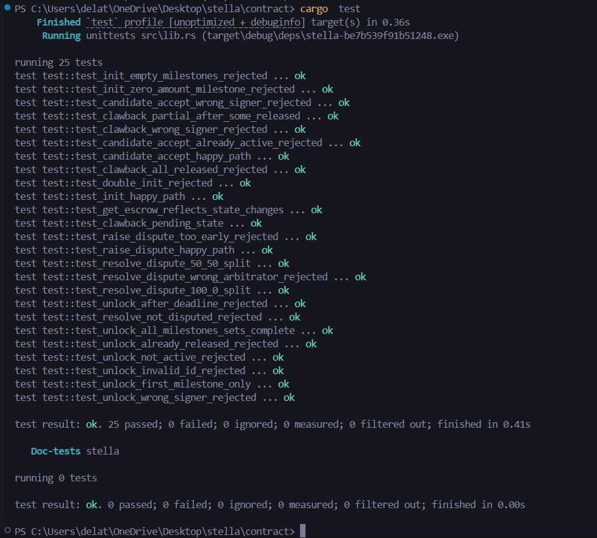
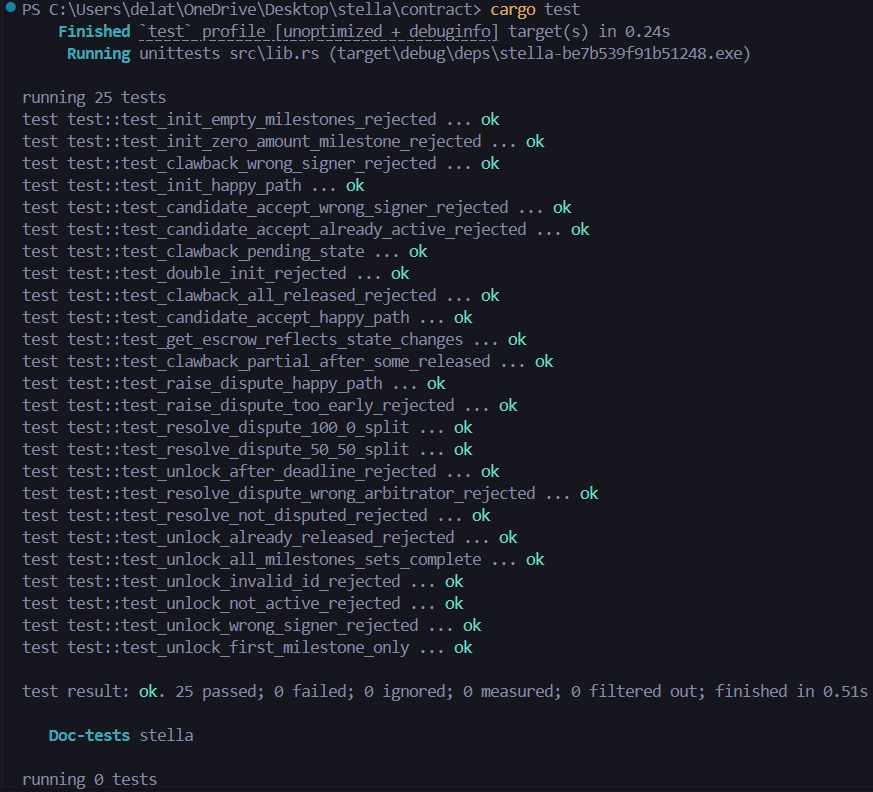
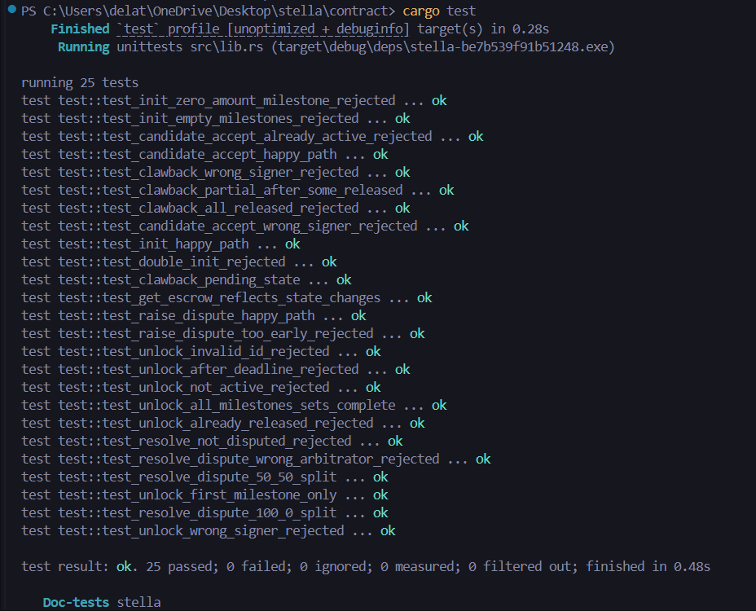

# ⭐ Stella ⭐

<div align="center">
  
  <h1>Stella</h1>
  
  <p><strong>A milestone-based escrow dApp built on Soroban to end the Day Zero poverty trap for fresh graduates.</strong></p>

  <p>
    <a href="https://stella-escrow.vercel.app/"></a>
    &nbsp;&nbsp;&nbsp;&nbsp;&nbsp;&nbsp;
    <a href="https://github.com/delatorrecj/stellar"></a>
  </p>

  <p>
    
    
    
    <a href="https://github.com/delatorrecj/stellar/actions/workflows/ci.yml"></a>
  </p>
</div>

---

## 1-MIN DEMO VIDEO

<div align="center">
  <a href="https://youtu.be/-ttPz9u8iZk">
    
  </a>
  <br/>
  <sub>▶ Click to watch the 1-min walkthrough on YouTube</sub>
</div>

---

## What is Stella?

Stella bridges the trust gap between employers and job candidates during onboarding. Employers lock onboarding funds into a Soroban smart contract. Candidates claim those funds as they complete milestones. If something goes wrong, employers can recover their remaining balance. No middlemen, no delays, no hidden fees.

**Built for the Stellar Smart Contract Bootcamp 2026.**

---

## Architecture

### System Design (V2.0 Dispute-Resolution State Machine)





> **V2.0 Spotlight:** Introducing the **Dispute Resolution Engine**. Candidates can now raise a formal dispute if a contract passes its deadline without full release. A designated platform arbitrator reviews contributions and executes an on-chain split (BPS-based) to ensure fairness.

### Directory Structure

```
stella/
├── contract/              Soroban smart contract (Rust)
│   └── src/
│       ├── lib.rs         V2.0 Lifecycle + Dispute Resolution Logic
│       ├── test.rs        25 unit tests (T-01 to T-25)
│       ├── types.rs       State machine (Pending → … → Resolved)
│       └── events.rs      7 on-chain event emitters
│
├── frontend/              React + Vite dApp (PWA)
│   └── src/
│       ├── pages/         Dashboard, Onboarding, Employer, Candidate, Arbitrator
│       ├── hooks/         useEscrow, useStellar, useActivity, useOnboarding
│       ├── lib/           Contract Client (contract.ts), RPC Pool (rpc.ts)
│       └── components/    ActiveEscrowCard, CreateEscrowForm, QuickGuide, etc.
│
├── docs/                  Project documentation
│   ├── product_requirements.md   PRD & API signatures
│   ├── branding.md               Brand guidelines & design tokens
│   └── context.md                Bootcamp context & session log
│
├── scripts/               Utility scripts
│   └── init_contract.mjs  One-time contract initialization
│
└── README.md              ← You are here
```

## Smart Contract (V2.0)

| Function                | Description                                   | Guard           |
| ----------------------- | --------------------------------------------- | --------------- |
| `initialize`            | One-time setup (Admin + Native Token)         | Admin Only      |
| `init_escrow`           | Create multi-milestone escrow (Locks Funds)   | Employer        |
| `candidate_accept`      | Transitions escrow Pending → Active           | Candidate       |
| `unlock_milestone`      | Releases specific funds to Candidate          | Employer        |
| `clawback`              | Returns unreleased funds to Employer          | Employer        |
| `raise_dispute`         | Flag contract for arbitration (Post-Deadline) | Candidate       |
| `resolve_dispute`       | Final fund split by trusted third-party       | Arbitrator Only |
| `get_escrow`            | Fetches on-chain state & progress             | Public          |
| `get_candidate_escrows` | Lists employer addresses for a candidate      | Public          |

**Contract ID:** `CAZHXCM3UNLT7HJLYHFWBRWAF3PCFN5TR4QCNYDCGCQ6K3ZMU7X7ZSLH`
**Network:** Stellar Testnet (V22)
**Asset:** Native XLM (`CDLZFC3SYJYDZT7K67VZ75HPJVIEUVNIXF47ZG2FB2RMQQVU2HHGCYSC`)

## ⭐️ Project Stella (Bootcamp Pitch)

### The Problem

Fresh graduates in the Philippines looking for BPO jobs accept job offers and then ghost before Day 1 because they lack the ₱3,000–₱5,000 needed for mandatory pre-employment requirements (medical exams, NBI clearance), costing employers thousands in wasted recruitment time and empty seats.

### The Solution

Stella bridges this gap with a programmable escrow where employers lock onboarding funds into a Soroban smart contract, releasing partial payouts precisely as the candidate completes each verified milestone, ensuring zero-trust liquidity for graduates while protecting the employer's capital from advance-theft.

### Core Feature (MVP) & Why It Wins

An employer initiates an escrow locking 500 XLM into the Soroban contract. The employer then triggers `unlock_milestone` to securely release exactly 100 XLM for the candidate's first requirement, instantly transferring the funds directly to their wallet. It directly targets a massive, hyper-local friction point in the Philippine job market, perfectly exemplifying Soroban's superiority over unsecured cash advances.

---

## 📝 Rise In Submission Details

- **GitHub Repository:** [https://github.com/delatorrecj/stellar](https://github.com/delatorrecj/stellar)
- **Contract ID:** `CAZHXCM3UNLT7HJLYHFWBRWAF3PCFN5TR4QCNYDCGCQ6K3ZMU7X7ZSLH`
- **Stellar Expert Link:** [https://stellar.expert/explorer/testnet/contract/CAZHXCM3UNLT7HJLYHFWBRWAF3PCFN5TR4QCNYDCGCQ6K3ZMU7X7ZSLH](https://stellar.expert/explorer/testnet/contract/CAZHXCM3UNLT7HJLYHFWBRWAF3PCFN5TR4QCNYDCGCQ6K3ZMU7X7ZSLH)
- **Short Description:** Stella uses a programmable milestone-based escrow to end the Day Zero poverty trap for fresh graduates. Employers lock pre-employment funds into a smart contract which conditionally releases exact liquidity to candidates as they complete onboarding requirements.

## Getting Started

### Prerequisites

- Node.js 18+
- Rust + `wasm32-unknown-unknown` target
- Stellar CLI v26+
- Freighter browser extension

### Run the Frontend

```bash
cd frontend
npm install
npm run dev
```

### Build & Test the Contract

```bash
cd contract
cargo test
stellar contract build
```

### Walkthrough & Testing Guide:

To test the complete end-to-end trust flow, we **mandate** using two separate browser profiles (or two different browsers like Chrome + Firefox). This allows you to simulate the Employer and Candidate side-by-side without wallet conflicts.

1.  **Preparation**:
    - Install **Freighter** on both browser profiles.
    - Set both to **Stellar Testnet**.
    - Fund both wallets using the "Fund with Friendbot" button (10,000 test XLM each).
2.  **Onboarding Guides (New Feature)**:
    - Whenever you connect a brand new wallet identity to either the Employer or Candidate dashboards for the first time, a **Quick Guide** will automatically pop up.
    - This is locally tracked: the guide automatically resets and displays itself anytime a _new_ unique ID is detected taking on a role.
3.  **Employer (Browser A)**:
    - Connect wallet, review the Quick Guide, and enter the portal.
    - Copy the **Candidate's address** from Browser B.
    - Lock funds: Enter the address, add 2-3 milestones (e.g., "Medical Exam" - 50 XLM, "NBI Clearance" - 100 XLM), set a deadline (30 days), and click **Lock Onboarding Funds**.
4.  **Candidate (Browser B)**:
    - Connect wallet, review the Quick Guide, and enter the portal.
    - You will see a "Pending Acceptance" card. Review the milestones and click **Accept Escrow**.
    - _System Check_: The status in Browser A (Employer) will instantly flip to "Active".
5.  **Release Funds (Browser A)**:
    - As the Employer, click **Release** on the first milestone.
    - _System Check_: The Candidate (Browser B) will see the milestone mark as paid, and their XLM balance (top left) will increase.
6.  **Conflict Simulation (Disputes)**:
    - If a deadline expires and funds aren't released, the Candidate (Browser B) can click **Raise Formal Dispute**.
    - This transitions the escrow to `Disputed`. The platform arbitrator securely handles the contract.

## Tech Stack

| Layer    | Technology                         |
| -------- | ---------------------------------- |
| Contract | Rust, Soroban SDK, soroban-sdk v22 |
| Frontend | React 19, Vite 6, Tailwind CSS v4  |
| PWA      | vite-plugin-pwa, Service Workers   |
| Wallet   | Freighter API v6                   |
| Network  | Stellar Testnet, Soroban RPC       |
| Design   | "Warm Fintech Trust"               |
| Fonts    | "Warm Fintech Trust"               |

## TESTS





## Author

- Carlos Jerico Dela Torre
- BS Computer Engineering
- Polytechnic University of the Philippines

## License

MIT — Stellar Bootcamp Philippines 2026 (April 18 • Whitecloak Ortigas)
